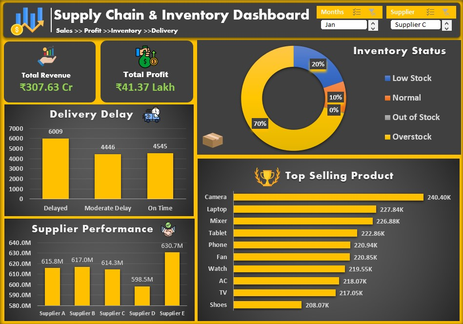

# 📦 Supply Chain & Inventory Analysis Dashboard


---

# 📌 Project Overview

This project is **Project 3 of my Internship – Supply Chain & Inventory Analysis**.

The project analyzes **15,000 supply chain and inventory records** to evaluate stock levels, product sales, supplier performance, shipping time, delivery delays, revenue, and profitability. The analysis converts cleaned business data into meaningful insights to support inventory and supply-chain decision-making.

---

# 🎯 Business Problem

Companies need to maintain the right inventory levels while ensuring efficient suppliers, timely deliveries, and profitable products.

This project aims to answer key business questions such as:

- Which products are frequently understocked or out of stock?
- Which suppliers generate the highest revenue?
- Which suppliers have higher shipping times?
- Which products generate the highest revenue?
- Which product category generates the highest profit?
- How can inventory levels be optimized?
- What is the overall impact of shipping time on business performance?

---

# 📁 Dataset Information

| Attribute | Details |
|---|---|
| Industry | Supply Chain & Inventory |
| File Format | Excel (.xlsx) |
| Records | 15,000 |
| Columns | 15 |
| Products | 10 |
| Categories | 4 |
| Suppliers | 5 |
| Warehouse Locations | 5 |
| Analysis Type | Inventory, Sales, Supplier & Profit Analysis |

### Dataset Columns

- Product_ID
- Product_Name
- Category
- Supplier_Name
- Order_Date
- Delivery_Date
- Stock_Quantity
- Reorder_Level
- Units_Sold
- Purchase_Cost
- Selling_Price
- Profit
- Revenue
- Warehouse_Location
- Shipping_Time_Days

---

# 🧹 Data Cleaning

The dataset was cleaned and prepared before analysis.

- Removed duplicate records
- Handled missing values
- Formatted date columns correctly
- Ensured numeric columns were correctly formatted
- Checked stock and inventory values
- Prepared calculated fields such as Revenue and Profit

---

# 🛠 Tools & Techniques

- Microsoft Excel
- SQL
- Power BI
- Data Cleaning
- Data Analysis
- Pivot Tables
- KPI Cards
- Charts & Data Visualization
- Inventory Analysis
- Supplier Performance Analysis
- Business Insights

---

# 📊 Dashboard KPIs

The analysis tracks important business metrics:

- 📦 **Total Units Sold:** 2,222,508
- 💰 **Total Revenue:** ₹3,076,312,144
- 📈 **Total Profit:** ₹4,136,961
- 🚚 **Average Shipping Time:** 5.50 days
- 📦 **Understocked Records:** 2,992
- ⚠️ **Out-of-Stock Records:** 32

---

# 📈 Business Analysis

The dashboard focuses on:

- Inventory Status
- Stock Available vs Units Sold
- Top Selling Products
- Supplier Performance
- Shipping & Delivery Delays
- Product Profitability
- Revenue Analysis
- Category Performance

---

# 💡 Key Insights

Based on the cleaned dataset:

- 🏆 **Camera** generates the highest product revenue at approximately **₹334,229,473**.
- 🤝 **Supplier E** generates the highest supplier revenue at approximately **₹630,683,746**.
- 🚚 **Supplier E** has the highest average shipping time at approximately **5.55 days**.
- 📈 **Fashion** is the highest-profit category with approximately **₹1,058,249 profit**.
- ⚠️ **2,992 records** have stock below the reorder level, indicating potential inventory-management issues.

---

# 💼 Business Recommendations

Based on the analysis:

- 📦 Monitor products below their reorder levels.
- 🔄 Maintain sufficient stock for high-selling products.
- 🤝 Review supplier performance and shipping times.
- 🚚 Identify causes of longer delivery/shipping times.
- 💰 Focus on products and categories with stronger profitability.
- 📊 Use dashboard KPIs regularly for inventory and supply-chain decisions.

---

# 📷 Dashboard Preview

> Add your Power BI / Excel dashboard screenshot below.



---

# 🚀 Skills Demonstrated

- Advanced Excel
- SQL
- Power BI
- Data Cleaning
- Data Analysis
- Inventory Analysis
- Supply Chain Analytics
- Supplier Performance Analysis
- KPI Development
- Data Visualization
- Dashboard Development
- Business Intelligence
- Business Reporting

---

# 📂 Repository Structure

```text
Supply-Chain-Inventory-Analysis
│
├── Cleaned Data.xlsx
├── Dashboard.png
├── Analysis.xlsx
└── README.md
```

---

# 🔮 Future Enhancements

- Add automated data refresh using Power Query
- Build an advanced Power BI dashboard
- Connect the dashboard with a SQL database
- Add demand and inventory forecasting
- Add supplier performance scoring
- Automate inventory alerts for understocked products

---

# 👨‍💻 Author

**Manish Kashyap**

🎓 B.Tech CSE | AI, ML & Deep Learning  
📊 Aspiring Data Analyst

---

⭐ If you found this project useful, feel free to star the repository.
